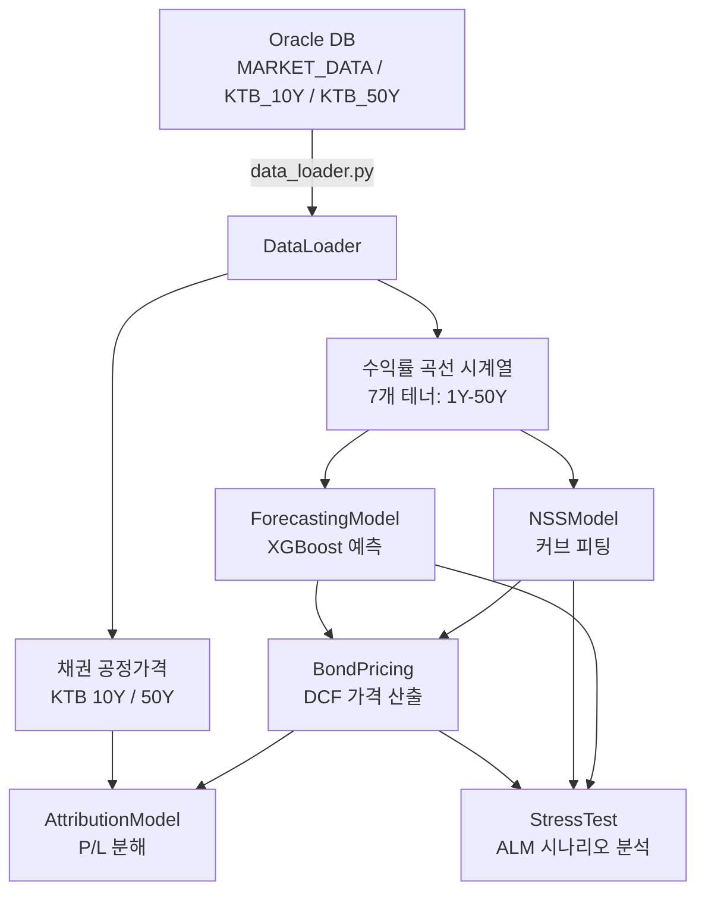
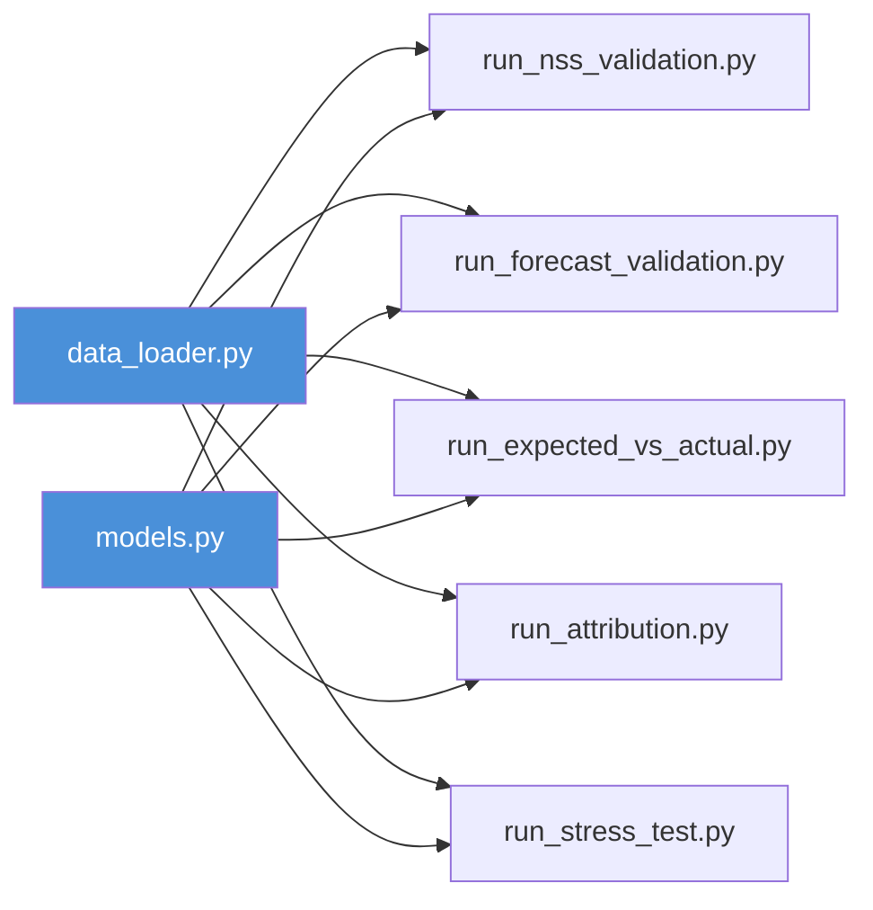

# ML-Driven Interest Rate Forecasting and Advanced Bond Performance Attribution System

## 1. 프로젝트 개요

본 프로젝트는 **한국 국채(KTB: Korea Treasury Bond)**를 대상으로, 머신러닝 기반 금리 예측과 채권 성과 귀속분석을 통합적으로 수행하는 시스템이다. Oracle DB에 축적된 실제 시장 데이터(2017년~2025년)를 활용하여 다음 4가지 기능을 엔드투엔드로 제공한다:

1. **금리 커브 모델링** — Nelson-Siegel-Svensson(NSS) 모델을 통한 수익률 곡선 적합(Fitting)
2. **금리 예측** — 테너별 독립 XGBoost 모델을 통한 1-스텝 선행 금리 수준 예측
3. **채권 P/L 귀속분석** — Carry/Roll-down, 금리 변동, 스프레드 효과로의 P/L 분해
4. **ALM 스트레스 테스트** — ML 예측 시나리오 기반 자산·부채·순자산 영향 평가

> **대상 채권**: KTB 10년물(발행 2025/6/10, 쿠폰 2.625%), KTB 50년물(발행 2024/9/10, 쿠폰 2.750%)

---

## 2. 아키텍처 및 모듈 구성

```
yield_curve_model/
├── data_loader.py               # 데이터 기반 계층
├── models.py                    # 핵심 모델군 (4개 클래스)
├── run_nss_validation.py        # NSS 피팅 검증
├── run_forecast_validation.py   # XGBoost 예측 정확도 검증
├── run_expected_vs_actual.py    # 기대 P/L vs 실적 P/L 비교
├── run_attribution.py           # P/L 귀속 분해 (Waterfall)
└── run_stress_test.py           # ALM 스트레스 테스트
```

### 2.1 데이터 흐름 개념도



---

## 3. 모듈 상세

### 3.1 `data_loader.py` — 데이터 기반 계층

| 기능 | 설명 |
|------|------|
| `load_market_data()` | `MARKET_DATA` 테이블에서 7개 테너(1Y, 3Y, 5Y, 10Y, 20Y, 30Y, 50Y)의 수익률을 일별로 조회 |
| `load_bond_prices()` | `KTB_10Y` / `KTB_50Y` 테이블에서 `FAIR_VALUE`(공정가격)를 조회 |

- **접속 대상**: Oracle DB(`localhost:1521/XE`, 사용자: `RISK_QUANT`)
- **환경 변수**: `.env` 파일로 관리(`DB_USER`, `DB_PASS`, `DB_DSN`)

### 3.2 `models.py` — 핵심 모델군

4개의 클래스가 정의되어 있으며, 상위에서 하위로 의존 관계를 형성한다:

#### 3.2.1 `NSSModel` — Nelson-Siegel-Svensson 수익률 곡선 모델

수익률 곡선을 6개 파라미터(β₀, β₁, β₂, β₃, τ₁, τ₂)로 표현한다.

- **캘리브레이션 방식**: Grid Search(τ₁, τ₂를 0.5 간격으로 탐색) + OLS(β₀~β₃를 최소제곱법으로 추정)
- **출력**: 임의 만기에 대한 현물금리(Spot Rate) 및 할인계수(Discount Factor)
- **용도**: 채권 가격 산출, 수익률 곡선의 평활화

#### 3.2.2 `ForecastingModel` — 테너별 XGBoost 예측

각 테너에 대해 독립적인 XGBoost 모델을 구축하고, **차분 계열의 래그 피처**를 사용하여 1스텝 선행 금리 변동을 예측한다.

- **전처리**: 1차 차분(정상화) → 래그 피처(기본값: 2 래그)
- **모델**: `XGBRegressor(n_estimators=100, lr=0.05, max_depth=4)`
- **예측 방식**: 차분 예측 → 수준으로 역변환(`last_level + predicted_delta`)
- **검증**: Walk-Forward Validation(1스텝 선행 예측을 반복 수행, 매 스텝 실제 데이터 참조)

#### 3.2.3 `BondPricing` — 채권 가격·듀레이션 산출

NSS 곡선에서 도출한 현물금리를 이용하여 DCF(할인현금흐름법)로 이론가격을 산출한다.

- **입력**: 쿠폰율, 잔존 만기, 액면가(10,000), 이자 지급 빈도(반기)
- **출력**: 이론가격, Macaulay 듀레이션, 유효 듀레이션(β₀ 병렬 시프트 방식)

#### 3.2.4 `AttributionModel` — P/L 귀속 분해

기초(T) → 기말(T+dt) 채권의 P/L을 3개 요인으로 분해한다:

| 구성 요소 | 계산 로직 |
|-----------|-----------|
| **Carry / Roll-down** | 「커브 불변·시간 경과만」으로 발생하는 P/L. P(잔존↓, Curve_T) − P(잔존, Curve_T) + Income |
| **Rate Change** | 커브 변동에 의한 효과. P(잔존↓, Curve_T+dt) − P(잔존↓, Curve_T) |
| **Spread Effect** | 실제 시장가격 P/L과 모델 가격 P/L의 차이(= 신용 스프레드·유동성 등의 잔차) |

---

## 4. 실행 스크립트 및 출력물

### 4.1 `run_nss_validation.py` — NSS 피팅 검증
- **목적**: NSS 모델이 수익률 곡선을 적절하게 적합하는지 검증
- **방법**: 데이터 중 3개 시점(최초·중간·최종)에서 각각 캘리브레이션 후, 실측값과 피팅 곡선을 비교
- **출력**: `nss_validation.png`

### 4.2 `run_forecast_validation.py` — 예측 정확도 검증
- **목적**: XGBoost 예측의 정확도를 Out-of-Sample(2025년 하반기, 약 125일)로 검증
- **방법**: Walk-Forward Validation(1스텝 선행 예측을 반복 수행, 매 스텝 실제 데이터 참조)
- **지표**: RMSE(bp), R² Score(테너별)
- **출력**: `forecast_validation.png`(R² 스코어가 범례에 포함)

### 4.3 `run_expected_vs_actual.py` — 기대 P/L vs 실적 P/L
- **목적**: ML 예측에 기반한 「기대 P/L」과 실제 시장가격에 의한 「실적 P/L」을 비교
- **방법**: T0(2025/6/30)까지의 데이터로 모델 학습, T1-1(2025/12/29) 실제 데이터를 참조하여 T1(2025/12/30) 예측
- **출력**:
  - `expected_vs_actual_curve.png` — 예측 vs 실적 수익률 곡선 비교
  - `expected_vs_actual_table.png` — P/L 비교 테이블(방향성 정답률 포함)

### 4.4 `run_attribution.py` — P/L 귀속 분해
- **목적**: 2025년 하반기 10Y/50Y KTB의 P/L을 요인 분해
- **출력**:
  - `attribution_table.png` — 귀속 요약 테이블
  - `attribution_waterfall.png` — 워터폴 차트

### 4.5 `run_stress_test.py` — ALM 스트레스 테스트
- **목적**: ML 예측(T1-1 실제 데이터 → T1 예측)의 2025년 12월 커브를 「스트레스 시나리오」로 적용하여 자산·부채 영향을 평가
- **ALM 설정**:
  - 부채 = 자산 총액의 80%, 부채 듀레이션 = 15년(가정)
  - 자산 듀레이션 = 10Y/50Y의 가중평균 유효 듀레이션
  - Duration Gap = D_A − (L/A) × D_L
- **출력**: `stress_test_dashboard.png`(충격 상세 테이블 + ALM 영향 테이블 + 바 차트)

---

## 5. 모듈 간 의존 관계



| 실행 스크립트 | 사용 모델 클래스 |
|--------------|-----------------|
| `run_nss_validation.py` | `NSSModel` |
| `run_forecast_validation.py` | `ForecastingModel` |
| `run_expected_vs_actual.py` | `NSSModel`, `ForecastingModel`, `BondPricing` |
| `run_attribution.py` | `NSSModel`, `BondPricing`, `AttributionModel` |
| `run_stress_test.py` | `NSSModel`, `ForecastingModel`, `BondPricing` |

---

## 6. 결과의 함의 (Implications)

### 6.1 금리 예측의 높은 정확도
- Walk-Forward 검증에서 R² > 0.97(전 테너)을 달성. 테너별 독립 XGBoost 모델이 단기·중기·초장기 모든 영역에서 높은 적합도를 보인다.
- 이는 차분 계열의 래그 구조가 금리의 단기 국소 트렌드를 효과적으로 포착하고 있음을 의미한다.
- 단, 본 검증은 매 스텝 실제 데이터를 참조하는 One-step ahead 방식이므로, 장기 다단계 예측에서의 정확도와는 구별하여 해석해야 한다.

### 6.2 P/L 예측의 방향성 일치
- Expected vs Actual 분석을 통해 ML 예측 기반 기대 P/L이 실적 P/L과 방향성(부호)에서 일치하는지를 평가한다. 방향성 일치는 포지션 구축 판단의 타당성을 뒷받침한다.

### 6.3 귀속 분해의 리스크 시사점
- Carry/Roll-down은 시간 경과에 따른 안정적인 수익원을 나타낸다. Rate Change는 시장의 금리 변동 리스크를, Spread Effect는 모델로 포착하기 어려운 시장 고유 리스크(신용·유동성)를 반영한다.
- 초장기채(50Y)는 듀레이션이 극히 길기 때문에 Rate Change의 기여도가 크게 나타나는 경향이 있다.

### 6.4 ALM 스트레스 테스트의 실무적 가치
- ML 예측 시나리오는 기존의 병렬 시프트(Parallel Shift) 시나리오와 달리, **커브 형태의 변화(스티프닝/플래트닝)를 반영**하는 점에서 보다 현실적인 스트레스 시나리오가 된다.
- Duration Gap의 양/음 부호가 금리 변동 시나리오 하에서 순자산에 대한 영향 방향을 결정한다.
- 이는 보험사 및 ALM 펀드에서의 리스크 자본 적정성 평가에 직접 활용 가능하다.

---

## 7. 기술 스택

| 계층 | 도구 |
|------|------|
| 데이터베이스 | Oracle DB (oracledb 드라이버) |
| 데이터 처리 | pandas, numpy |
| 머신러닝 | XGBoost (scikit-learn 호환) |
| 시각화 | matplotlib |
| 환경 관리 | python-dotenv |
